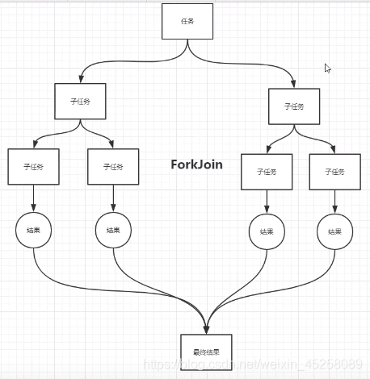

##  ForkJoinPool类 JDK 1.7
> ForkJoin 并发执行任务，提高效率，在大数据量表现显著。最适合的是计算密集型的任务。
### ForkJoin工作原理
> 将大量的数据分成多个子任务处理，然后合并。

### ForkJoin特点
>+ 工作窃取：该线程的任务执行完之后，就会去窃取其他线程没有执行完的任务，把任务拿到自己这里来执行，提高效率。
>+ 用的双端队列

    那么为什么需要使用工作窃取算法呢？
        假如我们需要做一个比较大的任务，我们可以把这个任务分割为若干互不依赖的子任务，
        为了减少线程间的竞争，于是把这些子任务分别放到不同的队列里，并为每个队列创建
        一个单独的线程来执行队列里的任务，线程和队列一一对应，比如A线程负责处理A队列里的任务。
        但是有的线程会先把自己队列里的任务干完，而其他线程对应的队列里还有任务等待处理。
        干完活的线程与其等着，不如去帮其他线程干活，于是它就去其他线程的队列里窃取一个任务来执行。
        而在这时它们会访问同一个队列，所以为了减少窃取任务线程和被窃取任务线程之间的竞争，
        通常会使用双端队列，被窃取任务线程永远从双端队列的头部拿任务执行，
        而窃取任务的线程永远从双端队列的尾部拿任务执行。
      
    工作窃取算法的优势
        工作窃取算法的优点是充分利用线程进行并行计算，并减少了线程间的竞争，
        其缺点是在某些情况下还是存在竞争，比如双端队列里只有一个任务时。
        并且消耗了更多的系统资源，比如创建多个线程和多个双端队列。
    
   
### 常用方法
> * public <T> ForkJoinTask<T> submit(ForkJoinTask<T> task) 提交一个ForkJoinTask来执行
> * ForkJoinTask是一个抽象类方法，如果要使用ForkJoinPool去执行代码，
> 就得继承ForkJoinTask的子抽象类去实现，然后使用ForkJoinPool的submmit方法去使用

### 案例 ForkJoinDemo.java
>   案例 使用ForkJoin,并行Stream计算大数据的和
>   * Recursive 递归
>   * parallel 平行
 
 